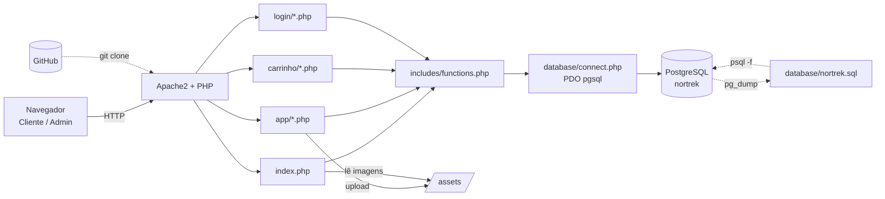
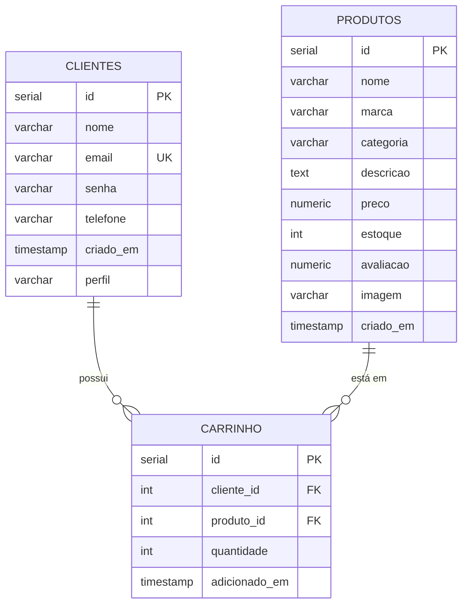
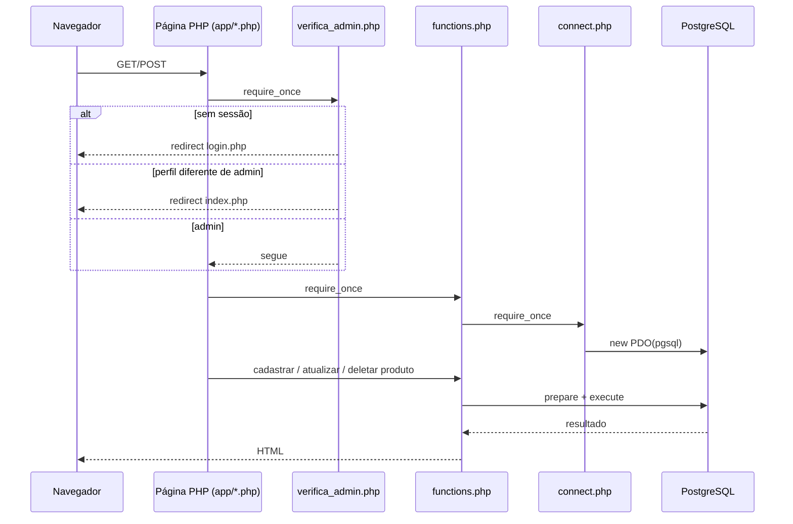
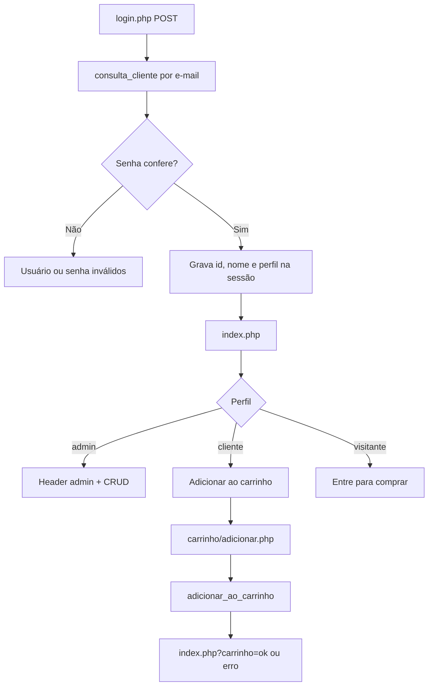
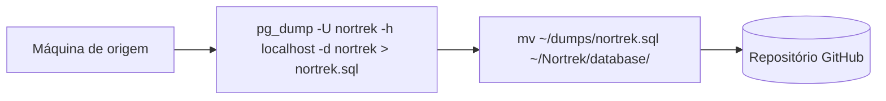
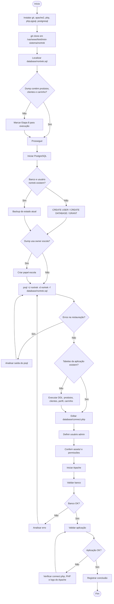

# 🏕️ Nortrek — Documentação Técnica e Procedimento de Restauração do Banco

## Sumário

1. [Visão geral do projeto](#1-visão-geral-do-projeto)
2. [Levantamento de requisitos](#2-levantamento-de-requisitos)
3. [Arquitetura e fluxo do sistema](#3-arquitetura-e-fluxo-do-sistema)
4. [Processo de restauração do banco de dados](#4-processo-de-restauração-do-banco-de-dados)
5. [Fluxograma da restauração](#5-fluxograma-da-restauração)
6. [Dependências e pré-requisitos](#6-dependências-e-pré-requisitos)
7. [Configuração](#7-configuração)
8. [Validação pós-restauração](#8-validação-pós-restauração)
9. [Tratamento de erros](#9-tratamento-de-erros)
10. [Arquivos relacionados à restauração](#10-arquivos-relacionados-à-restauração)
11. [Segurança](#11-segurança)
12. [Rastreabilidade e evidências](#12-rastreabilidade-e-evidências)
13. [Oportunidades de melhoria](#13-oportunidades-de-melhoria)

---

## 1. Visão geral do projeto

### 1.1 Objetivo

O **Nortrek** é uma aplicação web em PHP para gerenciar o catálogo e o estoque de uma loja de equipamentos de camping e trilhas. Centraliza a vitrine de produtos para o cliente e oferece ao administrador (gerente) um CRUD de produtos, com perfis de acesso `admin` e `cliente`. O sistema também possui carrinho de compras para clientes.

### 1.2 Tecnologias

| Camada | Tecnologia |
|---|---|
| Back-end | PHP 8.0 ou superior |
| Acesso a dados | PDO + driver `pgsql` |
| Banco de dados | PostgreSQL |
| Servidor web | Apache2 |
| Front-end | HTML + CSS (design system com variáveis CSS); JavaScript em `sobre/sobre.php` |
| Controle de versão | Git / GitHub |

### 1.3 Estrutura de diretórios

```text
nortrek/
├── index.php                  # Vitrine pública, filtros e carrinho
├── README.md
├── Processo do DUMP.txt       # Notas de dump e restauração
├── app/                       # CRUD administrativo (perfil admin)
│   ├── create.php  select.php  select_w.php  update.php  delete.php
├── carrinho/
│   ├── carrinho.php  adicionar.php  remover.php
├── login/
│   ├── login.php  cadastrar.php  logout.php  verifica_admin.php  verifica_cliente.php
├── includes/
│   ├── functions.php          # Lógica de negócio e consultas SQL
│   ├── header.php  footer.php
├── database/
│   ├── connect.php            # Conexão PDO
│   ├── nortrek.sql            # Dump SQL
│   ├── -- Tabela de produtos da Nortrek.pgsql   # DDL de produtos e clientes
│   ├── -- ALTER TABLE clientes.pgsql             # Coluna perfil / promoção a admin
│   └── CREATE TABLE carrinho (.pgsql             # DDL do carrinho
├── assets/                    # Imagens dos produtos
├── css/                       # Design system
└── sobre/                     # Página institucional
```

### 1.4 Relação entre os componentes

- Toda consulta passa por `includes/functions.php`, que carrega `database/connect.php` e disponibiliza `$conexao` (PDO) às páginas.
- As imagens dos produtos são gravadas em `assets/`; o banco guarda apenas o nome do arquivo.
- O backup é feito com `pg_dump` (SQL puro), movido para `database/` e versionado no Git.

### 1.5 Arquitetura geral



### 1.6 Modelo de dados



A tabela `carrinho` possui `UNIQUE (cliente_id, produto_id)` e `ON DELETE CASCADE` nas duas chaves estrangeiras.

---

## 2. Levantamento de requisitos

### 2.1 Requisitos funcionais

| ID | Requisito | Comportamento | Módulo | Evidência |
|---|---|---|---|---|
| RF01 | Verificar Administrador | Valida credenciais, grava `id`, `nome` e `perfil` na sessão; páginas de `app/` bloqueiam quem não é `admin` | `login/login.php`, `login/verifica_admin.php` | `consulta_cliente()` |
| RF02 | Verificar Cliente | Cadastro de cliente (perfil `cliente`) e login; `verifica_cliente.php` exige sessão | `login/cadastrar.php`, `login/verifica_cliente.php` | `cadastrar_cliente()` |
| RF03 | Cadastrar Produto | Formulário com nome, marca, categoria, descrição, preço, estoque, avaliação e imagem | `app/create.php` | `cadastrar_produto()` |
| RF04 | Consultar Produto | Vitrine com busca, filtro de categoria e ordenação; consulta administrativa por lista e por ID | `index.php`, `app/select.php`, `app/select_w.php` | `buscar_produtos_filtrados()`, `listar_produtos()`, `consultar_produto()` |
| RF05 | Atualizar Produto | Altera os dados pelo ID; imagem opcional; remove a imagem anterior | `app/update.php` | `atualizar_produto()` |
| RF06 | Excluir Produto | Exclui produto por ID via POST | `app/delete.php` | `deletar_produto()` |
| RF07 | Adicionar ao carrinho | Somente perfil `cliente`, com estoque ≥ 1; soma 1 se já existir, limitado ao estoque | `carrinho/adicionar.php` | `adicionar_ao_carrinho()` |
| RF08 | Exibir carrinho | Lista itens com subtotal e total | `carrinho/carrinho.php` | `listar_carrinho()` |
| RF09 | Remover item do carrinho | Remove item do cliente logado | `carrinho/remover.php` | `remover_do_carrinho()` |
| RF10 | Contador do carrinho | Exibe a quantidade de itens no cabeçalho | `index.php`, `sobre/sobre.php` | `contar_itens_carrinho()` |
| RF11 | Logout | Encerra a sessão | `login/logout.php` | `session_destroy()` |
| RF12 | Página "Sobre" | Apresentação, categorias e contato | `sobre/sobre.php` | — |
| RF13 | Cabeçalho por perfil | Cabeçalho distinto para admin, cliente e visitante | `index.php`, `includes/header.php` | Condicionais sobre `$_SESSION['perfil']` |

#### Requisitos de backup e restauração

| ID | Requisito | Origem |
|---|---|---|
| RB01 | O backup é gerado com `pg_dump` (SQL puro) do banco `nortrek`, usuário `nortrek` | `Processo do DUMP.txt` |
| RB02 | O dump é colocado em `database/nortrek.sql` e versionado | `Processo do DUMP.txt` |
| RB03 | A restauração usa `psql -U nortrek -d nortrek -f database/nortrek.sql` em banco `nortrek` previamente criado | `Processo do DUMP.txt` |
| RB04 | Após restaurar, as credenciais de conexão são ajustadas ao ambiente | `Processo do DUMP.txt` |
| RB05 | Dependências do ambiente: `git`, `apache2`, `php`, `php-pgsql`, `postgresql`, `postgresql-contrib` | `Processo do DUMP.txt` |
| RB06 | O projeto reside em `/var/www/html/mini-sistema/nortrek` | `Processo do DUMP.txt` e URLs do código |

### 2.2 Requisitos não funcionais

| ID | Título | Situação |
|---|---|---|
| RNF01 | Tecnologias base | PHP + PostgreSQL |
| RNF02 | Padrão de arquitetura | Lógica concentrada em `includes/functions.php` |
| RNF03 | Compatibilidade web | Navegadores modernos (CSS com `:has()`, `:user-invalid`) |
| RNF04 | Proteção contra SQL Injection | `prepare` com parâmetros em todas as consultas |
| RNF05 | Sessões e autenticação | `$_SESSION` e `session_destroy()` no logout |
| RNF06 | Upload seguro | Validação de extensão, MIME e 2 MB em `atualizar_produto()`; nome único (`uniqid`) em `cadastrar_produto()` |
| RNF07 | Validação de perfil no servidor | `verifica_admin.php` nas páginas de `app/` |
| RNF08 | Design system | `css/variables.css` e componentes |
| RNF09 | Interface intuitiva | Formulários padronizados |
| RNF10 | Responsividade | `css/responsive.css` |
| RNF11 | Feedback ao usuário | `alert()`, `echo` e componente `.alert` |
| RNF12 | Tempo de resposta | Consultas simples sobre PK e UNIQUE |

#### Complementos por categoria

| Categoria | Descrição |
|---|---|
| Segurança | Perfis `admin`/`cliente`; saída escapada com `htmlspecialchars` na vitrine e no carrinho |
| Integridade dos dados | FKs com `ON DELETE CASCADE`; `CHECK` em `avaliacao` (0 a 5) e `quantidade` (> 0); `UNIQUE(email)` |
| Compatibilidade | PHP ≥ 8.0 (`str_starts_with`); extensões `pdo_pgsql` e `fileinfo` |
| Armazenamento | Imagens em `assets/`; nome do arquivo em `produtos.imagem` |
| Manutenção | CSS modular; URLs fixas `/mini-sistema/nortrek/...` |
| Recuperação de dados | Dump manual em SQL puro e restauração via `psql` |
| Controle de acesso | `verifica_admin.php` e `verifica_cliente.php` |

---

## 3. Arquitetura e fluxo do sistema

### 3.1 Acesso ao banco e controle de acesso



### 3.2 Login e carrinho



### 3.3 Backup



---

## 4. Processo de restauração do banco de dados

O procedimento segue o cenário de servidor Ubuntu/Apache descrito em `Processo do DUMP.txt`, com o projeto em `/var/www/html/mini-sistema/nortrek`.

### Etapa 1 — Instalar dependências do sistema

- **Objetivo:** instalar Git, Apache, PHP com driver PostgreSQL e PostgreSQL.
- **Pré-requisitos:** Linux com `apt`, usuário com `sudo`, acesso à internet.
- **Comando:**
  ```bash
  sudo apt update && sudo apt install git apache2 php php-pgsql postgresql postgresql-contrib -y
  ```
- **Resultado esperado:** pacotes instalados sem erro.
- **Possíveis erros:** repositório apt indisponível; PHP inferior a 8.0.
- **Validação:**
  ```bash
  php -v
  php -m | grep -i pgsql
  psql --version
  ```

### Etapa 2 — Obter o código do projeto

- **Objetivo:** colocar o projeto no diretório web com o nome `nortrek`.
- **Pré-requisitos:** Etapa 1.
- **Comando:**
  ```bash
  sudo mkdir -p /var/www/html/mini-sistema
  cd /var/www/html/mini-sistema
  sudo git clone https://github.com/GabrielFachinello09/Nortrek.git nortrek
  cd nortrek
  ```
- **Resultado esperado:** existe `database/nortrek.sql` dentro do projeto.
- **Possíveis erros:** diretório já existente; repositório inacessível.
- **Validação:** `ls database`.

### Etapa 3 — Localizar e conferir o arquivo de backup

- **Objetivo:** confirmar que o dump existe e identificar seu conteúdo.
- **Pré-requisitos:** Etapa 2.
- **Comando:**
  ```bash
  ls -lh database/nortrek.sql
  head -n 30 database/nortrek.sql
  grep -n "CREATE TABLE" database/nortrek.sql
  ```
- **Arquivo envolvido:** `database/nortrek.sql` (SQL puro com `COPY ... FROM stdin`; restaurado com `psql`, não com `pg_restore`).
- **Resultado esperado:** lista das tabelas contidas no dump.
- **Possíveis erros:** arquivo ausente ou vazio.
- **Validação:** conferir se `produtos`, `clientes` e `carrinho` aparecem; caso contrário, executar a Etapa 8.

### Etapa 4 — Iniciar o PostgreSQL

- **Objetivo:** servidor de banco em execução.
- **Comando:**
  ```bash
  sudo systemctl start postgresql
  sudo systemctl status postgresql
  ```
- **Resultado esperado:** serviço `active`.
- **Possíveis erros:** serviço não inicia; porta 5432 ocupada.
- **Validação:** `sudo -u postgres psql -c "SELECT version();"`.

### Etapa 5 — Criar usuário e banco

- **Objetivo:** criar o papel `nortrek` e o banco `nortrek`.
- **Pré-requisitos:** Etapa 4; senha escolhida.
- **Comando:**
  ```bash
  sudo -u postgres psql
  ```
  ```sql
  CREATE USER nortrek WITH PASSWORD '<senha>';
  CREATE DATABASE nortrek OWNER nortrek;
  GRANT ALL PRIVILEGES ON DATABASE nortrek TO nortrek;
  \q
  ```
- **Resultado esperado:** `CREATE ROLE`, `CREATE DATABASE`, `GRANT`.
- **Possíveis erros:** `role "nortrek" already exists`; `database "nortrek" already exists`.
- **Validação:** `sudo -u postgres psql -c "\l nortrek"`.

Se o banco já existir com dados, gere um backup antes de restaurar:
```bash
pg_dump -U nortrek -h localhost -d nortrek > ~/dumps/nortrek_antes_restauracao_$(date +%F_%H%M).sql
```

### Etapa 6 — Papel `escola`

- **Objetivo:** evitar erros `role "escola" does not exist`, pois o dump contém `ALTER ... OWNER TO escola`.
- **Comando (opcional):**
  ```bash
  sudo -u postgres psql -c "CREATE ROLE escola;"
  ```
- **Resultado esperado:** `CREATE ROLE`.
- **Validação:** após a Etapa 7, o `psql` não exibe erros de papel.

### Etapa 7 — Restaurar o dump

- **Objetivo:** carregar o dump no banco `nortrek`.
- **Pré-requisitos:** Etapas 3 a 5; estar na raiz do projeto.
- **Comando:**
  ```bash
  psql -U nortrek -d nortrek -f database/nortrek.sql
  ```
  Em caso de falha de autenticação *peer*, usar TCP:
  ```bash
  psql -U nortrek -h localhost -d nortrek -f database/nortrek.sql
  ```
- **Arquivo envolvido:** `database/nortrek.sql`.
- **Resultado esperado:** sequência de `SET`, `CREATE TABLE`, `COPY`, `setval` e `ALTER TABLE`, sem `ERROR`.
- **Possíveis erros:** autenticação, `\restrict` não reconhecido, papel `escola` inexistente.
- **Validação:**
  ```bash
  psql -U nortrek -h localhost -d nortrek -c "\dt"
  ```

### Etapa 8 — Criar as tabelas da aplicação

- **Objetivo:** garantir as tabelas `produtos`, `clientes` (com `perfil`) e `carrinho`, usadas por `includes/functions.php`.
- **Pré-requisitos:** Etapa 7. Executar somente se essas tabelas não existirem.
- **Ordem:** `produtos` → `clientes` → `ALTER TABLE clientes` → `carrinho`.
- **Arquivos envolvidos:**
  - `database/-- Tabela de produtos da Nortrek.pgsql` (`produtos`, `clientes`)
  - `database/-- ALTER TABLE clientes.pgsql` (coluna `perfil`)
  - `database/CREATE TABLE carrinho (.pgsql`
- **Comando:** descomentar os `CREATE TABLE` e o `ALTER TABLE` e executar:
  ```bash
  psql -U nortrek -h localhost -d nortrek
  ```
  ```sql
  -- 1) CREATE TABLE produtos (...)
  -- 2) CREATE TABLE clientes (...)
  -- 3) ALTER TABLE clientes ADD COLUMN perfil VARCHAR(20) NOT NULL DEFAULT 'cliente';
  -- 4) CREATE TABLE carrinho (...)
  ```
- **Resultado esperado:** `CREATE TABLE` (3×) e `ALTER TABLE`.
- **Possíveis erros:** `relation already exists`; `relation "clientes" does not exist` ao criar `carrinho` fora de ordem.
- **Validação:** `\d produtos`, `\d clientes`, `\d carrinho`.

### Etapa 9 — Ajustar as credenciais de conexão

- **Objetivo:** apontar a aplicação para o banco restaurado.
- **Comando:**
  ```bash
  nano database/connect.php
  ```
  ```php
  $host   = "<host>";
  $dbname = "nortrek";
  $user   = "nortrek";
  $pass   = "<senha>";
  ```
- **Arquivo envolvido:** `database/connect.php` (usa a porta padrão 5432).
- **Resultado esperado:** as páginas exibem `Conexão com Postgres realizada!`.
- **Possíveis erros:** `Erro: SQLSTATE[...]` (host, usuário ou senha incorretos).
- **Validação:** abrir `http://<servidor>/mini-sistema/nortrek/index.php`.

### Etapa 10 — Definir um administrador

- **Objetivo:** ter ao menos um usuário com `perfil = 'admin'`.
- **Pré-requisitos:** Etapa 8 e um cliente cadastrado em `login/cadastrar.php`.
- **Comando:**
  ```sql
  UPDATE clientes SET perfil = 'admin' WHERE email = '<email_do_admin>';
  ```
- **Arquivo envolvido:** `database/-- ALTER TABLE clientes.pgsql`.
- **Resultado esperado:** `UPDATE 1`.
- **Validação:** `SELECT id, email, perfil FROM clientes;` e login com acesso às telas de `app/`.

### Etapa 11 — Imagens e permissões de `assets/`

- **Objetivo:** permitir upload e exibição das imagens.
- **Ação:**
  - `assets/` deve ser gravável pelo usuário do Apache.
  - Os arquivos referenciados em `produtos.imagem`, além de `sem-foto.jpg`, `logo-nortrek.png` e `pinheiro.png`, devem existir em `assets/`.
- **Resultado esperado:** imagens carregam e o upload funciona.
- **Possíveis erros:** "Erro ao salvar o arquivo de imagem na pasta assets."; imagens quebradas.
- **Validação:** cadastrar um produto de teste com imagem e abrir a vitrine.

### Etapa 12 — Iniciar o Apache

- **Comando:**
  ```bash
  sudo systemctl start apache2
  sudo systemctl status apache2
  ```
- **Resultado esperado:** `active (running)`.
- **Validação:** `curl -I http://localhost/mini-sistema/nortrek/index.php` retorna `HTTP 200`.

### Etapa 13 — Validar banco e aplicação

Executar o checklist da [seção 8](#8-validação-pós-restauração).

### Etapa 14 — Registrar a conclusão

Registrar data, origem do dump, versão do PostgreSQL e resultado das validações.

---

## 5. Fluxograma da restauração



---

## 6. Dependências e pré-requisitos

| Item | Requisito |
|---|---|
| Sistema operacional | Linux com `apt` (Ubuntu) |
| Banco de dados | PostgreSQL (dump gerado na versão 18.6) |
| Cliente `psql` | Compatível com as linhas `\restrict` / `\unrestrict` do dump |
| PHP | 8.0 ou superior; extensões `pdo_pgsql` e `fileinfo` |
| Servidor web | Apache2 |
| Git | Para clonar o projeto |
| Diretório | `/var/www/html/mini-sistema/nortrek` |
| Variáveis de ambiente | Nenhuma; credenciais em `database/connect.php` |
| Papéis do banco | `nortrek` (dono do banco); `escola` (opcional, owner no dump) |
| Serviços | `postgresql` ativo na restauração; `apache2` ativo na validação |
| Permissões | `sudo` para instalar e clonar; `assets/` gravável pelo Apache |
| Rede | Porta 5432 entre aplicação e banco |

---

## 7. Configuração

### 7.1 Arquivos que influenciam o banco

| Arquivo | Influência |
|---|---|
| `database/connect.php` | Host, banco, usuário e senha da aplicação |
| `database/nortrek.sql` | Conteúdo restaurado |
| `database/*.pgsql` | DDL das tabelas da aplicação |
| `includes/functions.php` | Carrega `connect.php` e define as consultas |

### 7.2 Exemplo de `database/connect.php`

```php
<?php
$host   = "<host>";
$dbname = "<database>";
$user   = "<usuario>";
$pass   = "<senha>";
```

Equivalência em formato `.env`, apenas como referência (o projeto não utiliza `.env`):

```env
DB_HOST=<host>
DB_PORT=<porta>
DB_NAME=<database>
DB_USER=<usuario>
DB_PASSWORD=<senha>
```

---

## 8. Validação pós-restauração

### 8.1 Banco

- [ ] PostgreSQL ativo: `sudo systemctl status postgresql`
- [ ] Conexão: `psql -U nortrek -h localhost -d nortrek -c "SELECT 1;"`
- [ ] Tabelas `produtos`, `clientes` e `carrinho` presentes (`\dt`)
- [ ] Coluna `perfil` em `clientes` (`\d clientes`)
- [ ] Contagens coerentes com a origem:
  ```sql
  SELECT 'produtos' t, count(*) FROM produtos
  UNION ALL SELECT 'clientes', count(*) FROM clientes
  UNION ALL SELECT 'carrinho', count(*) FROM carrinho;
  ```
- [ ] Existe ao menos um admin: `SELECT count(*) FROM clientes WHERE perfil = 'admin';`
- [ ] Sequências ajustadas:
  ```sql
  SELECT max(id) FROM produtos;
  SELECT last_value FROM produtos_id_seq;
  ```
- [ ] Sem itens órfãos no carrinho:
  ```sql
  SELECT * FROM carrinho c LEFT JOIN produtos p ON p.id = c.produto_id WHERE p.id IS NULL;
  ```

### 8.2 Aplicação

- [ ] `index.php` carrega e lista os produtos
- [ ] Imagens exibidas (ou `sem-foto.jpg` como alternativa)
- [ ] Busca, categoria e ordenação funcionam
- [ ] Cadastro de cliente e login funcionam
- [ ] Admin acessa `app/create.php`, `select.php`, `select_w.php`, `update.php` e `delete.php`
- [ ] Cliente adiciona e remove itens do carrinho; contador atualiza
- [ ] Logout encerra a sessão
- [ ] Sem erros críticos em `/var/log/apache2/error.log`

---

## 9. Tratamento de erros

| Erro | Causa provável | Como identificar | Correção | Validação |
|---|---|---|---|---|
| `relation "produtos" does not exist` (ou `clientes`, `carrinho`) | Tabelas da aplicação não criadas | Erro SQL na página; `\dt` | Executar a Etapa 8 | `\dt` lista as tabelas |
| `Erro: SQLSTATE[08006]` / `connection refused` | Host ou credenciais incorretos em `connect.php`; PostgreSQL parado | Mensagem exibida por `connect.php` | Corrigir `connect.php`; `systemctl start postgresql` | Página exibe "Conexão com Postgres realizada!" |
| `password authentication failed` | Senha diferente entre o banco e `connect.php` | Mensagem do PDO ou `psql` | `ALTER USER nortrek PASSWORD '<senha>'` ou ajustar `connect.php` | Reconectar |
| `Peer authentication failed` | `psql` local sem `-h localhost` | Mensagem do `psql` | Usar `-h localhost` | Restauração executa |
| `role "escola" does not exist` | `OWNER TO escola` no dump | `ERROR` nas linhas `ALTER` | Criar o papel `escola` | Reexecutar sem erros |
| `invalid command \restrict` | `psql` mais antigo que o `pg_dump` que gerou o dump | Erro no início da restauração | Usar `psql` compatível | Restauração completa |
| `relation "..." already exists` | Restauração repetida no mesmo banco | Erros `already exists` | Restaurar em banco novo | Sem erros |
| `Call to undefined function str_starts_with()` | PHP anterior à 8.0 | Erro ao atualizar produto com imagem | Atualizar PHP para 8.0 ou superior | `php -v` |
| `headers already sent` | Saída (`echo`) de `connect.php` antes de `header()` | Aviso no login ou carrinho | Remover o `echo` de `connect.php` ou ativar `output_buffering` | Redirecionamento funciona |
| "Erro ao salvar o arquivo de imagem na pasta assets." | `assets/` sem permissão de escrita | Alerta ao cadastrar | Ajustar dono/permissão para o usuário do Apache | Novo cadastro funciona |
| Imagens quebradas | Pasta `assets/` sem as imagens | `` sem carregar | Restaurar os arquivos em `assets/` | Vitrine exibe imagens |
| CSS e links quebrados | Projeto fora de `/mini-sistema/nortrek` | 404 em `css/style.css` | Servir sob `/mini-sistema/nortrek` | Estilo carregado |
| Telas de `app/` redirecionam para a vitrine | Usuário sem `perfil = 'admin'` | Redirecionamento de `verifica_admin.php` | Etapa 10 | Acesso liberado |
| Aviso em `consultar_produto` | ID inexistente | Aviso na tela | Informar ID existente | Dados exibidos |

---

## 10. Arquivos relacionados à restauração

| Arquivo/Diretório | Função | Relação com restauração |
|---|---|---|
| `Processo do DUMP.txt` | Notas de dump e restauração | Fonte do procedimento |
| `database/nortrek.sql` | Dump SQL (PostgreSQL 18.6) | Arquivo restaurado via `psql -f` |
| `database/connect.php` | Conexão PDO e credenciais | Ajustado após a restauração |
| `database/-- Tabela de produtos da Nortrek.pgsql` | DDL de `produtos` e `clientes` | Criação das tabelas |
| `database/-- ALTER TABLE clientes.pgsql` | Coluna `perfil` e promoção a admin | Perfis de acesso |
| `database/CREATE TABLE carrinho (.pgsql` | DDL de `carrinho` | Criação do carrinho |
| `includes/functions.php` | Consultas SQL | Define as tabelas e colunas necessárias |
| `login/login.php`, `login/verifica_admin.php` | Autenticação e perfis | Dependem de `clientes.perfil` |
| `assets/` | Imagens dos produtos | Complementa o banco |
| `README.md` | Documentação | Requisitos e procedimento |

---

## 11. Segurança

### 11.1 Comportamento existente

- Consultas com *prepared statements* (PDO).
- Páginas administrativas protegidas por `verifica_admin.php`; carrinho por `verifica_cliente.php`.
- `logout.php` limpa e destrói a sessão.
- `atualizar_produto()` valida extensão, MIME e tamanho (2 MB) da imagem.
- Saída escapada com `htmlspecialchars` em `index.php` e `carrinho.php`.

### 11.2 Recomendações

- **Credenciais:** manter fora do Git e do diretório público; usar usuário de banco com menor privilégio.
- **Backups:** não versionar dumps com dados reais; restringir permissões (`chmod 600`); armazenar fora de `/var/www/html`.
- **Acesso ao banco:** restringir `pg_hba.conf` e `listen_addresses`; não expor a porta 5432.
- **Scripts:** revisar qualquer `.sql` antes de executar.
- **Logs:** registrar a restauração e o Apache, sem gravar senhas.
- **Produção:** restaurar apenas com backup prévio e validação em ambiente de teste.
- **Aplicação:** usar `password_hash()` no cadastro, escapar saídas em `listar_produtos()` e `consultar_produto()`, validar upload em `cadastrar_produto()`, proteger `delete.php` contra CSRF.

---

## 12. Rastreabilidade e evidências

| Informação | Fonte | Local |
|---|---|---|
| Backup com `pg_dump` | Notas | `Processo do DUMP.txt` |
| Movimentação do dump para `database/` | Notas | `Processo do DUMP.txt` |
| Criação de usuário e banco | Notas | `CREATE USER nortrek ...; CREATE DATABASE nortrek OWNER nortrek;` |
| Restauração com `psql -f` | Notas | `Processo do DUMP.txt` |
| Instalação de pacotes e clone | Notas | `apt install git apache2 php php-pgsql postgresql postgresql-contrib` |
| Conteúdo do dump | Dump | `database/nortrek.sql` |
| SQL puro (`COPY ... FROM stdin`) | Dump | `database/nortrek.sql` |
| DDL de `produtos` e `clientes` | DDL | `database/-- Tabela de produtos da Nortrek.pgsql` |
| Coluna `perfil` | DDL | `database/-- ALTER TABLE clientes.pgsql` |
| DDL de `carrinho` | DDL | `database/CREATE TABLE carrinho (.pgsql` |
| Conexão PDO | Código | `database/connect.php` |
| Carregamento da conexão | Código | `includes/functions.php` (`require_once`) |
| Consultas às tabelas | Código | `includes/functions.php` |
| PHP 8.0+ | Código | `str_starts_with` em `atualizar_produto()` |
| Validação de upload | Código | `atualizar_produto()` |
| Imagens em `assets/` | Código | `functions.php`, `index.php` |
| Controle de acesso | Código | `login/verifica_admin.php`, `login/verifica_cliente.php` |
| Carrinho | Código | `adicionar_ao_carrinho()` |
| URLs `/mini-sistema/nortrek/` | Código | `index.php`, `login/*.php`, `includes/header.php` |
| Requisitos originais | Documentação | Versão anterior do `README.md` (SRS) |

---

## 13. Oportunidades de melhoria

Sugestões para avaliação futura:

| Área | Sugestão |
|---|---|
| Automatização | Script `restore.sh` que execute as etapas de restauração |
| Backup | Rotina agendada (`cron` ou `systemd timer`) com `pg_dump` e retenção |
| Backup prévio | Dump automático do estado atual antes de restaurar |
| Dump | Gerar `database/nortrek.sql` contendo `produtos`, `clientes` e `carrinho`, com `--no-owner --no-privileges` |
| Validação | Script SQL de verificação pós-restauração |
| Logs | Registro de execução, data, origem do dump e resultado |
| Rollback | Restaurar em banco temporário e trocar após validar |
| Arquivos | Incluir `assets/` no backup |
| Configuração | Variáveis de ambiente fora do Git; suporte a porta; remover o `echo` de `connect.php` |
| Documentação | Plano de recuperação de desastre com RPO/RTO |
| Versionamento | Migrações versionadas do esquema (`database/migrations/`) |
| Segurança | `password_hash()`, escape de saídas, validação de upload no cadastro, CSRF, `session_regenerate_id()` |
